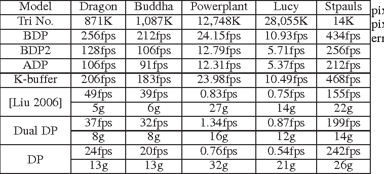

## Order Independent Transparency Methods 

### Depth peeling
[Paper](https://my.eng.utah.edu/~cs5610/handouts/order_independent_transparency.pdf)

[Sample](https://raw.githack.com/pailhead/three.js/depth-peel-stencil/examples/webgl_materials_depthpeel.html)

Pros: 
 - Sufficient visual quality
 - Constant memory allocation
 - Don't require post sorting
 - Support older hardware
Cons:
 - Can induce a significant overhead on the geometry processing stage and rasterization, cumullative over all iteration steps.

A linear complexity algorithm to capture and sort multiple fragment in single pass. Multiple rasterizations of the scenes. Produces good images but is too slow for scenes with many layers.

### Dual Depth Peeling 
[Paper](https://my.eng.utah.edu/~cs5610/handouts/DualDepthPeeling.pdf)

[Article](https://medium.com/@shrekshao_71662/dual-depth-peeling-implementation-in-webgl-11baa061ba4b)

[Sample](https://tsherif.github.io/webgl2examples/oit-dual-depth-peeling.html)

The idea is to interatively get the nearest layer of the fragments, store their color, then look for the next layer. With support of the multiple render targets we can start depth peeling from the two sides, from the front and back. The method reduces the number of passes from N to N/2+1, which may speed up performance. The N value is a max depth complexity of the scene.

### Layered Weighted Blended Order-Independent Transparency
[Paper](https://jcgt.org/published/0002/02/09)

[Implemtation article](http://casual-effects.blogspot.com/2015/03/implemented-weighted-blended-order.html)

[WebGL sample](https://tsherif.github.io/webgl2examples/oit.html)

[Three.js sample](https://raw.githack.com/arose/three.js/oit/examples/webgl_oit.html)

[Cesium sample](http://bagnell.github.io/cesium/Apps/Sandcastle/gallery/OIT.html)

[Video](https://youtu.be/axvmoEqcTp8)

Decent performance and image quality. Contains three passes. Requires to render opaque and transparent object separately. Devices must support output to multiple render targets.

### Multi-Layer Depth Peeling via Fragment Sort

[Paper](https://www.microsoft.com/en-us/research/wp-content/uploads/2006/06/tr-2006-81.pdf)

[Sample](?)

Extended version of original DP. Reduces the computation time significantly for real scenes. Basically it peels several transparent layers in one path. Stores color and depth in multiple render target buffers.

### Bucket Depth Peeling

[Presentation](https://www.highperformancegraphics.org/previous/www_2009/presentations/liu-bucket.pdf)

[Paper](https://www.semanticscholar.org/paper/Efficient-depth-peeling-via-bucket-sort-Liu-Huang/978a83ddf48c59f18529d69a9a1d0f0428881db0)

[Paper](https://drive.google.com/file/d/12JYmusKSvpsdVua1emdqIPJTY7vBFKzq/view)
[Chaper 1 of Book "GPU Pro 360 Guide to 3DEngine](https://drive.google.com/file/d/1199PPCQka5oFZq9_Q09htGEeriLLnPO6/view)

Exploits multiple render targets as bucket array per pixel. Fragments are scattered into different buckets and sorted by a bucket sort. Results show up to x32 times speedup to depth peeling especially for large scenes and the results are visually faithful.

### A-buffer

[Article](https://blog.icare3d.org/2010/06/fast-and-accurate-single-pass-buffer.html)

[Presentation](https://github.com/cgaueb/MFR/blob/master/Multimedia/EG2020_STAR_presentation.pptx)

[Sample](?)

Provides good performance. Complex scene may require a big amount of memory. There is no optimal solution but rather a more suitable match for each application’s requirements. Possible variations: linked-lists, fixed-size arrays, variable size arrays.

### K-buffer

Reduces the computation cost and memory consumption by capturing the k-best subset of all generated fragments, usually the closest to the camera, in a single iteration.
Limitations:
- Flickering artefacts
- "k" value is set manually
- Small value may result in artifacts
- Large value may lead to wasteful memory allocation and performance drop.
There are solutions that aiming to eliminate that problems.

Several times faster than Dual DP accordinly to testing [results](https://www.highperformancegraphics.org/previous/www_2009/presentations/liu-bucket.pdf).

## Performance

### DP vs WB

[Paper](https://graphics.tudelft.nl/Publications-new/2021/FEE21/layered_weighted_blended_order_independent_transparency.pdf)

Scene: engine, ~150k  non-opaque triangles
Card: NVIDIA GTX 480

| Method           | Frame time( ms ) |
| ---------------- | ---------------- |
| DP               | ~100             |
| Weighted Blended | ~5               |

### DP vs DP via Fragment Sort

[Paper](https://www.microsoft.com/en-us/research/wp-content/uploads/2006/06/tr-2006-81.pdf)

DPFS - DP via Fragment Sort
Card: NVIDIA Geforce 6800

| Scene  | Polygons | Max number of transparent layers | DPFS (fps) | DP (fps) |
| ------ | -------- | -------------------------------- | ---------- | -------- |
| grass  | 384      | 20                               | 2.11       | 1.09     |
| tree   | 384      | 20                               | 2.23       | 1.18     |
| villy  | 15472    | 31                               | 4.51       | 2.62     |
| stpaul | 14780    | 23                               | 4.72       | 3.15     |

### Bucket Depth Peeling

Bucket Sort DP - DP - Dual DP - K-buffer - Fragment Sort DP

[Paper](https://www.highperformancegraphics.org/previous/www_2009/presentations/liu-bucket.pdf)

Card: NVIDIA Geforce 8800 GTX

## Summary

| Method               | WebGL Support    | Image quality | Performance  | Implementation difficulty | Sample | Description                                                                                                   |
| -------------------- | ---------------- | ------------- | ------------ | ------------------------- | ------ | ------------------------------------------------------------------------------------------------------------- |
| DP                   | Desktop,Mobile   | Good          | 1x           | Normal                    | +      | Produces good images but is too slow for scenes with many layers                                              |
| Dual DP              | Desktop,Mobile   | Good          | Up to 2x DP  | Medium                    | +      | Faster implementation of depth peeling                                                                        |
| Weighted Blended     | Desktop,Mobile   | Decent        | ++++         | High                      | +      | Happy medium of cost/fidelity                                                                                 |
| DP via Fragmen Sort  | Desktop?,Mobile? | Good          | 2x DP        | High                      | -      | Extended version of original DP. Reduces the computation time significantly for real scenes                   |
| A-buffer             | Desktop?,Mobile? | Decent        | +++          | High                      | -      | Provides good performance. Complex scene may require a big amount of memory                                   |
| K-buffer             | Desktop?,Mobile? | Decent        | Up to 9x DP  | High                      | -      | Reduces the computation cost and memory consumption by capturing the k-best subset of all generated fragments |
| Bucket Depth Peeling | Desktop?,Mobile? | Decent        | Up to 11x DP | High                      | -      | Uses power of MRT to speedup depth peeling up to 32 times. Provides faithful visual results                   |

<!-- Methods in the order in which they should be tested on real project:
1. Dual DP 
2. Weighted Blended
3. DP via Fragmen Sort -->

